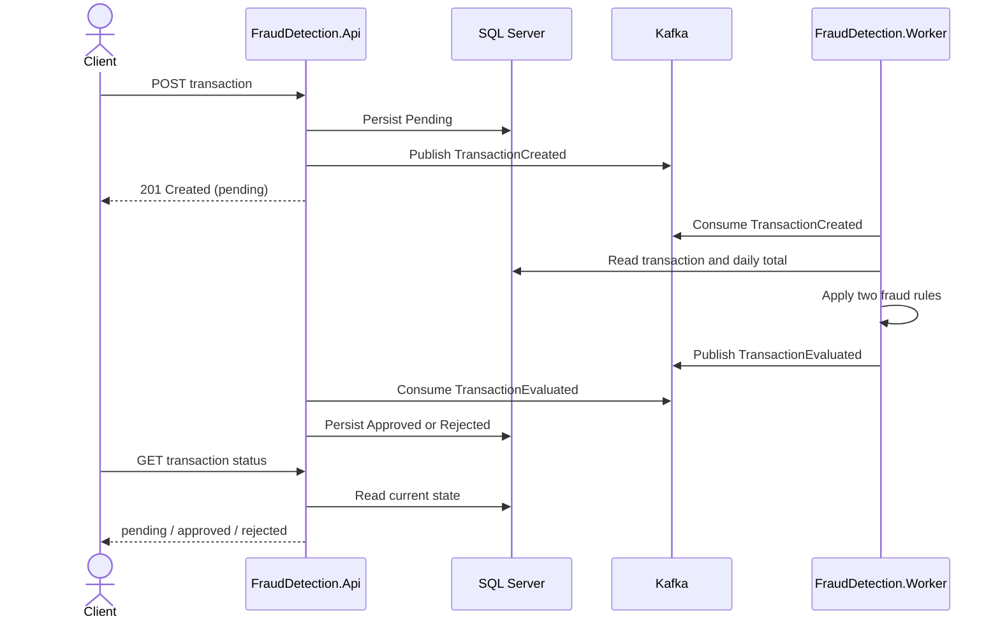

# Fraud Detection — Architecture

This document describes the implementation in this repository. The system meets the technical challenge with an asynchronous API → Kafka → worker → Kafka → API flow. It is a local portfolio demo, not a production financial service.

## Request and decision flow



The worker does not write the final status directly. The response event is what causes the API to apply the domain transition and persist it. Each consumer commits its Kafka offset after its work succeeds.

## Components

| Component | Responsibility |
|---|---|
| `FraudDetection.Api` | HTTP resources, input validation, initial persistence, `TransactionCreated` publisher, `TransactionEvaluated` consumer, status query, health endpoints |
| `FraudDetection.Worker` | Consumes created transactions, loads the data needed for the daily rule, evaluates the domain rules, publishes the result event |
| `FraudDetection.Application` | Use cases, ports, commands, results, integration events, and validation |
| `FraudDetection.Domain` | Transaction state invariants, the two specifications, and deterministic rule evaluation; no infrastructure dependencies |
| `FraudDetection.Infrastructure` | EF Core/SQL Server persistence and Kafka producer implementation |

The API and worker are composition roots. Application ports (`ITransactionRepository`, `IEventPublisher`) keep the use cases independent of SQL Server and Kafka. Features are organized by use case and use explicit handlers; the project does not add a mediator dependency for this small challenge.

## Challenge rules and assumptions

- Only three states exist: `pending`, `approved`, and `rejected`.
- A transaction is rejected if `value > 2000` or the accumulated amount is `> 20000`.
- The challenge does not define the daily aggregation key, time zone, or whether rejected transactions count. This implementation sums all recorded transactions for the same `sourceAccountId` and UTC calendar day, including the transaction being evaluated and previously rejected transactions. This is an explicit implementation assumption.
- The API accepts the challenge's literal `tranferTypeId` field name and the correctly spelled `transferTypeId` alias.
- SQL Server is the chosen database; Kafka is required by the challenge. Docker Compose runs SQL Server, a single-node Kafka KRaft broker, API, and worker locally.

See [CHALLENGE_TRACEABILITY.md](CHALLENGE_TRACEABILITY.md) for the requirement-to-code-and-test matrix.

## Design choices and trade-offs

- **Explicit CQRS and feature slices:** commands and handlers make the small set of use cases visible without mediator indirection. The slices are creation, evaluation, applying an evaluation response, and querying a transaction.
- **Response event owns the state change:** the worker publishes the decision; the API consumes it and persists the terminal state, matching the challenge's request/response wording.
- **At-least-once Kafka delivery:** a crash between publishing and offset commit may cause redelivery. The API accepts identical terminal responses idempotently and rejects conflicting terminal decisions.
- **Invalid messages:** malformed, unknown, or inconsistent messages are logged and skipped to avoid blocking a partition. Such a transaction may remain pending and needs operator follow-up; a dead-letter topic and bounded retry policy are future work.
- **Persist then publish on creation:** a publish failure can leave a persisted `pending` transaction. A transactional outbox is the production improvement for this gap.
- **Shared database:** API and worker share SQL Server for this compact local demo. Production service ownership and database boundaries would need a separate design.
- **Security scope:** authentication/authorization is not implemented because it is outside the challenge. Swagger is enabled for demonstration. Do not expose this demo to real financial data or treat it as a production service.

## Operations and validation

- `GET /health/live` checks that the API process is serving and does not depend on Kafka or SQL Server.
- `GET /health/ready` checks SQL Server and Kafka; `GET /health` is its compatibility alias.
- GitHub Actions is defined once at the workspace root in [`../../.github/workflows/ci.yml`](../../.github/workflows/ci.yml). It restores, builds in Release with warnings treated as errors, runs tests, validates Compose, and builds API/worker images locally in the runner. It does not publish images or deploy infrastructure.
- Automated tests cover domain rules, handlers, persistence, API contracts, and response application. The full broker-backed API → Kafka → Worker → Kafka → API round trip was manually validated with Docker Compose on 2026-10-06; CI does not yet run a broker-backed E2E test.

## Source layout

```text
src/
  FraudDetection.Api/             HTTP adapter and response consumer
  FraudDetection.Worker/          Kafka evaluation service
  FraudDetection.Application/     Use cases, ports, events, validation
  FraudDetection.Domain/           Entity, state rules, specifications
  FraudDetection.Infrastructure/  EF Core, SQL Server, Kafka adapter
tests/
  FraudDetection.UnitTests/
  FraudDetection.IntegrationTests/
```

For setup, sample requests, verification status, and the local demo, see [README.md](README.md). Interview notes are in [docs/interview/portfolio-talk-track.md](docs/interview/portfolio-talk-track.md).
